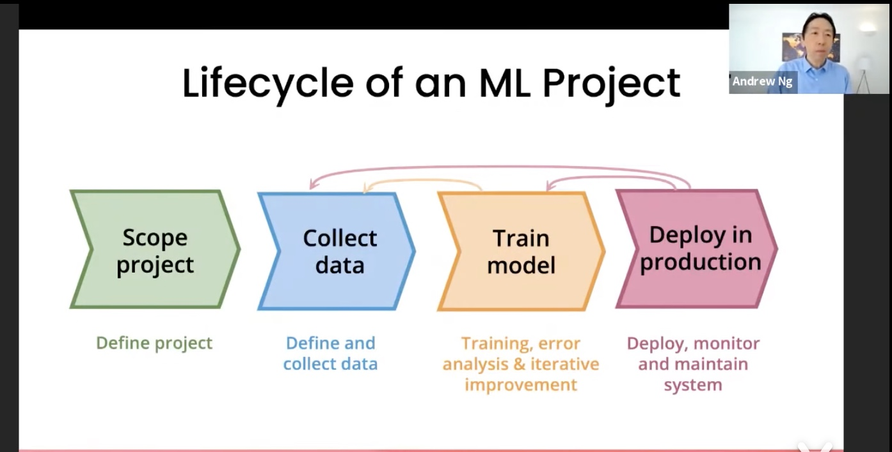
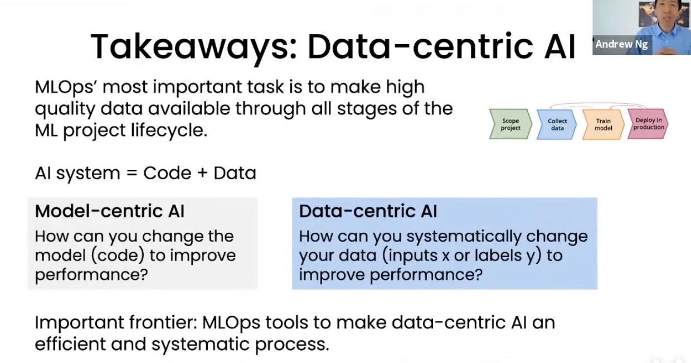

## <a href='https://arxiv.org/abs/2111.08647'>DataCLUE: A Benchmark Suite for Data-centric NLP</a>

**You can get the english version of [README](./README_en.md).**

### <a href='https://docs.qq.com/doc/p/51a1f46f64a72bc2ac0633427dc59d6e8d1b8d0a?dver=2.1.27277463'>DataCLUE介绍文章.中文版</a>


## 内容导引
| 章节 | 描述 |
|-|-|
| [简介](#简介) | 介绍以数据为中心的AI测评(DataCLUE)的背景 |
| [任务描述](#任务描述) | 任务描述 |
| [实验结果](#实验结果) | 针对各种不同方法，在DataCLUE上的实验对比 |
| [实验分析](#实验分析) | 对人类表现、模型能力和任务进行分析 |
| [数据为中心的AI_方法论介绍](#数据为中心的AI-方法论介绍) | 数据为中心的AI：方法论介绍 |
| [DataCLUE有什么特点](#DataCLUE有什么特点) | 特点介绍 |
| [基线模型及运行](#基线模型及运行) | 支持多种基线模型 |
| [DataCLUE测评及规则](#DataCLUE测评及规则) | DataCLUE测评及规则 |
| [数据集介绍](#数据集介绍) | 介绍数据集及示例 |
| [工具集介绍](#工具集介绍) | 介绍与DataCLUE搭配的工具集 |
| [学习资料](#学习资料) | 文章、PPT、分享视频及选手方案 |
| [联系方式与引用](#贡献与参与) | 如何参与项目或反馈问题|

## Update
- 20211214  更新了实验结果
- 20211203  增加了 triclue等数据集
- 20211122  增加了 IFLYTEK数据集
- 20211119  增加了 TNEWS 数据集
## 简介
以数据为中心（Data-centric）的AI，是一种新型的AI探索方向。它的核心问题是如何通过系统化的改造你的数据（无论是输入或者标签）来提高最终效果。
传统的AI是以模型为中心（Model-centric）的，主要考虑的问题是如何通过改造或优化模型来提高最终效果，它通常建立在一个比较固定的数据集上。
最新的数据显示超过90%的论文都是以模型为中心的，通过模型创新或学习方法改进提高效果，即使不少改进影响可能效果并不是特别明显。有些人认为当前的人工智能领域，
无论是自然语言处理（如BERT） 或计算机视觉(ResNet)， 已经存在很多成熟高效模型，并且模型可以很容易从开源网站如github获得；而与此同时，工业界实际落地
过程中可能有80%的时间用于 清洗数据、构建高质量数据集，或在迭代过程中获得更多数据，从而提升模型效果。正是看到了这种巨大的差别，在吴恩达等人的推动下这种
以数据为中心 （Data-centric）的AI进一步的系统化，并成为一个有具有巨大实用价值方法论。

DataCLUE是一个以数据为中心的AI测评。它基于CLUE benchmark，结合Data-centric的AI的典型特征，进一步将Data-centric的AI应用于
NLP领域，融入文本领域的特定并创造性丰富和发展了Data-centric的AI。在原始数据集外，它通过提供额外的高价值的数据和数据和模型分析报告（增值服务）的形式，
使得融入人类的AI迭代过程（Human-in-the-loop AI pipeline)变得更加高效，并能较大幅度的提升最终效果。


### DataCLUE测评.重要更新
任务更新、开启双周赛和双周赛奖励

    课题：如何通过提升数据集质量，获得更好效果（保持模型不变）？
    
    「新数据集启用」
    数据集和基线模型已经更新，训练方法保持一致。
    
    「新任务具有如下特点」
    
    1、学术友好：新增学术更友好的公开测试集test_public.json，参与者可以自己独立做测试和实验。
    
    2、挑战性高：训练集train、验证集dev，都具有高比例的错误标注的数据。公开测试集标注准确率高（超过95%）。
    
    3、资源消耗低：实验周期快，计算成本低。GPU环境单次实验3分钟完成；CPU环境也可较短时间完成训练。


## 任务描述
参与测评者需要改进任务下的数据集来提升任务的最终效果；将使用固定的模型和程序代码（公开）来训练数据集，并得到任务效果的数据。
可以对训练集、验证集进行修改或者移动训练集和验证集建的数据，也可以通过非爬虫类手段新增数据来完善数据集。可以通过算法或程序或者结合人工的方式来改进数据集。
参与测评者需提交修改后的训练集和验证的压缩包。

## 任务描述和统计
| Corpus   | Train     | Dev  |Test | Label Defintion  | Test_public(High Quality Data)   |
| :----:| :----:  |:----:  |:----:  |:----:  |:----:  |
|   CIC    | 10000 | 2000 | >=3000 |Stage 1 | Stage 2 | 
|   TNEWS    | 10000 | 2000 | >=3000 |Stage 1 | Stage 2 | 
|   IFLYTEK    | 10000 | 2000 | >=3000 |Stage 1 | Stage 2 |
|   AFQMC    | 10000 | 2000 | >=3000 |Stage 1 | Stage 2 |
|   QBQTC    | 10000 | 2000 | >=3000 |Stage 1 | Stage 2 |
|   TRICLUE    | 10000 | 2000 | >=3000 |Stage 1 | Stage 2 |

    Train/Dev: 含有噪声的数据，都含有一定比例有标注错误的标签；
    Test_public：高质量数据（标注准确率95%或以上），用于评估改进数据集算法的最新效果，不能用于模型训练。


## 改进数据集的baselines

为了进一步促进社区发展，我们收集了相应的[baseline代码和说明](baselines)
其中按照[单策略模型](baselines/single)和[多策略模型](baselines/multi)进行了分类
可欢迎大家[贡献自己的方法](baselines/CONTRIBUTING.md)

## 工具集(dckit)介绍

dckit: 用于改进数据集的工具集

为了方便上手，我们开发了[DataCLUE Toolkit (dckit)](dckit)，提供了基本的数据读取和存储以及评测功能。使用dckit进行开发也能够更加方便与其它算法进行整合。

#### 安装
`pip install -e .`
#### 使用
基于dckit你只需要关注于数据处理部分即可

```python
from dckit import read_datasets, random_split_data, evaluate

data = read_datasets()
# TODO 对数据进行处理

random_split_data(data)
f1 = evaluate()
```

## 实验结果

|    | CIC (macro F1) | IFLYTEK (macro F1)|TNEWS (macro F1)|AFQMC (macro F1)| 
| :----:| :----:  | :----:  | :----:  | :----:  | 
|  Human (in accuracy) | 87.40 |66.00| 71.00|81.00|
|  Baseline(<a href='https://github.com/ymcui/Chinese-BERT-wwm#%E4%B8%AD%E6%96%87%E6%A8%A1%E5%9E%8B%E4%B8%8B%E8%BD%BD'>RoBERTa_3L_wwm</a>) |  72.78 | 30.97|46.83|59.04 |
|   Data-centric | 74.62    |40.15 |49.34| ?|

   

实验结果见[单策略结果总结](./baselines/single/README.md)和[多策略结果总结](./baselines/multi/README.md)

 更多详细的实验结果，见：论文和介绍文章


## 数据为中心的AI-方法论介绍
这里简单介绍一下以数据为中心的AI的方法论。包括一张图介绍一下流程，并做一下说明；可以附加tips。

流程图：1.定义任务-->2.收集数据--->3.训练模型-->4.部署模型

    系统化方式、通过迭代形式改进数据集：
    #1.训练模型；
    #2.错误分析：发现算法模型在哪些类型的数据上表现不佳（如：数据过短导致语义没有表达完全、一些类别间概念容易混淆导致标签可能不正确）
    #3.改进数据：
      1）更多数据：数据增强、数据生成或搜集更多数据--->获得更多的输入数据。
      2）更一致的标签定义：当有些类别容易混淆的时候，改进标签的定义--->基于清晰的标签定义，纠正部分数据的标签。
    #4.重复#1-#3的步骤。
   
   

## DataCLUE有什么特点
1、国内首个以数据为中心的AI测评。之前的测评一般是在固定的数据集下使用不同的模型或学习方式来提升效果，而DataCLUE是需要改进数据集。

2、它是中文NLP任务在以数据为中心的思想下的实践。

3、更丰富的信息：除了常规的训练、验证和测试集外，它还额外提供了标签的定义、训练集中进一步标注后的高质量数据。结合这些额外的信息，使得
融入人类的AI迭代闭环（Human-in-the-loop AI pipeline)可以变得更加高效，并且在发挥算法模型在数据迭代过程中可以有更多空间和潜力。

4、增值服务：我们还额外提供模型训练和预测过程中的分析报告，为以数据为中心的AI的迭代过程变得更有方向和系统化。

## 基线模型及运行

即运行固定的模型和代码，来训练和在公开测试集上做预测

### 一键运行.基线模型与代码 Baseline with codes
    使用方式：
    1、克隆项目 
       git clone https://github.com/CLUEbenchmark/DataCLUE.git
       进入到项目目录 cd DataCLUE
    2、进入到相应的目录
       分类任务  
           例如：
           cd ./baselines/models_pytorch/classifier_pytorch
    3、运行对应任务的脚本(GPU方式): 会自动下载模型和任务数据并开始运行。
       bash run_classifier_xxx.sh
       1）运行: bash run_classifier_cic.sh 会开始cic任务的训练。
       训练完后也会得到在验证集上的效果，见 ./output_dir/bert/checkpoint_eval_results.txt
       2）运行: bash run_classifier_cic.sh predict 会在测试集上做预测，并且生成预测文件，见: /output_dir/bert/test_prediction.json
       3）得到了test_prediction.json，使用下面的脚本获得在公开测试集上的效果(test_public.json) 
       
       <a href='https://github.com/CLUEbenchmark/DataCLUE/blob/master/baselines/models_pytorch/classifier_pytorch/compute_f1.py'>compute_f1.py</a>
 或者：
 转到[colab链接](https://colab.research.google.com/drive/1NSoVeuiggRTfLP37Np6mFdbo8kjYWapZ?usp=sharing) 直接运行 并查看训练结果
  
## DataCLUE测评及规则
### 1.测评方式：
修改训练集和验证集，并将压缩包上传到<a href='https://www.CLUEbenchmarks.com'>CLUE benchmark</a>

使用如下命令得到压缩包: zip dataclue_<研究机构>_<用户名>_<时间字符串>.zip train.json dev.json

提交时，模型描述需包含关键词"dataclue"。研究机构、用户名，为【测评注册】页面的对应的名字。

具体格式见：<a href='./resources/dataclue_submit_examples/dataclue_submit_examples.zip'>提交样例</a>

### 2.测评规则：
###### 1.1 可以对训练集、验证集进行修改（输入文本或标签），或者移动训练集和验证集建的数据；
###### 1.2 可以通过非爬虫类手段增加数据来完善训练和验证集。增加数据方式，包括但不限于：数据增强、文本生成、结合分析定向生成或添加。
###### 1.3 可以通过算法或程序，或者结合人工的方式来改进数据集；
###### 2.1 鼓励通过结合算法、模型和程序来改进数据集，也同样鼓励算法模型结合人工进行数据改进；但纯人工方式的数据改进，评审环节将不得分。
###### 2.2 数据量限制：训练集和验证集的总数据量不能超过3万个样本。


### 4.自测脚本（f1 score）
    from sklearn.metrics import f1_score
    y_true = [1, 1, 1, 1, 2, 2, 2, 3, 3]
    y_pred = [1, 1, 2, 3, 2, 2, 3, 2, 3]
    #f1_micro = f1_score(y_true_list, y_pred_list, average='micro')
    f1_macro = f1_score(y_true_list, y_pred_list, average='macro')
    #print('f1_micro: {0}'.format(f1_micro))
    print('f1_macro: {0}'.format(f1_macro))

## 数据集介绍
### 单句子数据集
1、CIC 客户意图识别 Customer Intent Classification
该数据集关于客户意图的文本，包括118个类别。如：抱怨商品涨价了、表达不满/生气、表达赞美/满意、表示不想要了、表示地址正确等。
   
    数量，训练集(train)：10000 ；验证集(dev)：2000；测试集_公开(test_public)：2000；测试集_私有（test_private）：>=3000 
    例子：
    {"id": 10000, "label": "38", "sentence": "就一个吸汗带很便宜的呀", "label_des": "讨价还价"}
    {"id": 10002, "label": "114", "sentence": "不合适包运费险退换吗", "label_des": "咨询运费险赔付规则"}
    {"id": 10004, "label": "23", "sentence": "刚好昨天拍少了一件，那我退了重新拍吧", "label_des": "表示要重拍"}
    {"id": 10005, "label": "22", "sentence": "我有两个退货，麻烦同意下", "label_des": "表示需要退货退款"}
    {"id": 10006, "label": "4", "sentence": "第二件地址对的，一起发回四川哈", "label_des": "表示地址正确"}

另外IFLYTEK和TNEWS数据集与此格式一致
### 句子对数据集
1. [QBQTC
QQ浏览器搜索相关性数据集（QBQTC,QQ Browser Query Title Corpus）](https://github.com/CLUEbenchmark/QBQTC)，是QQ浏览器搜索引擎目前针对大搜场景构建的一个融合了相关性、权威性、内容质量、 时效性等维度标注的学习排序（LTR）数据集，广泛应用在搜索引擎业务场景中。

例子：

    {"label": "0", "sentence1": "名流置业集团股份有限公司广东区域中心", "sentence2": "名流置业集团广东区域中心-东莞名流置业有限公司怎么样名流置业集团广东区域中心-东莞名流置业有限公司好不好"}
    {"label": "1", "sentence1": "关于农村土地使用权的法律", "sentence2": "关于农村集体土地使用权的法律咨询-110网免费法律咨询"}
    {"label": "1", "sentence1": "weregrettoinformyouthat", "sentence2": "weregrettoinformyouthatthematerialsyouorderedare百度知道"}
    {"label": "1", "sentence1": "莫言", "sentence2": "莫言热爱军旅文学-新华网"}
    {"label": "1", "sentence1": "唐山市古冶区卑家店大众药房", "sentence2": "唐山市古冶区卑家店平安大药房"}
    {"label": "1", "sentence1": "一品威客", "sentence2": "一品威客开通vip一对一接单靠谱吗-知乎"}

其它 AFQMC和TRICLUE数据集格式一致


## 学习资料
1、<a href='https://www.bilibili.com/video/av587353739/'>吴恩达新课：从以模型为中心到以数据为中心的AI（1小时）</a>

## 联系方式与引用
   添加微信入DataCLUE群:
   <!--  -->
      

   QQ群:836811304
   
如果您觉得DataCLUE有用，并希望引用，您可以使用如下格式
```
@article{xu2021dataclue,
      title={DataCLUE: A Benchmark Suite for Data-centric NLP}, 
      author={Liang Xu and Jiacheng Liu and Xiang Pan and Xiaojing Lu and Xiaofeng Hou},
      year={2021},
      eprint={2111.08647},
      archivePrefix={arXiv},
      primaryClass={cs.CL}
}
```
