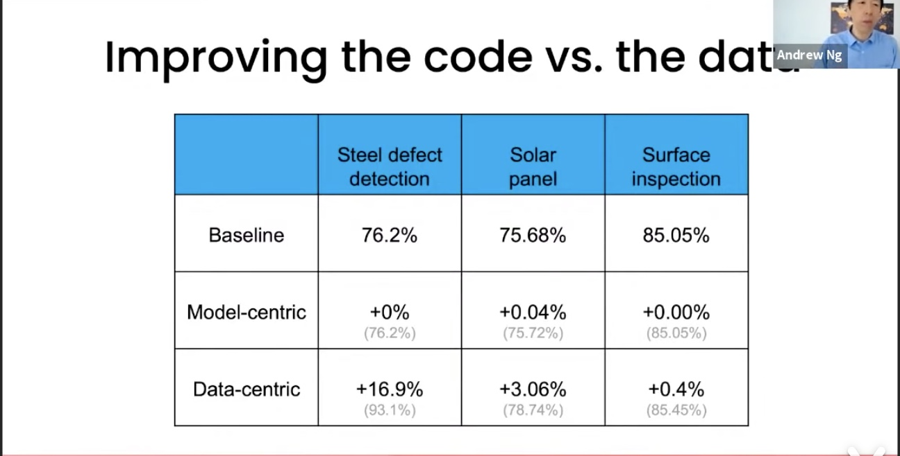
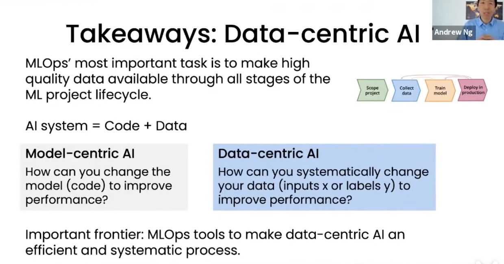

# DataCLUE: A Benchmark Suite for Data-centric NLP

You can get the Chinese Version at [README.md](./README.md)

## Table of Content

| Section                                                   | Description                                                       |
| --------------------------------------------------------- | ----------------------------------------------------------------- |
| [Introduction](#Introduction)                             | Background in DataCLUE                                            |
| [Task Description](#Task_Description)                     | Task Description                                                  |
| [Expironment Result](#Expironment_Results)                | Expironment Result                                                |
| [Result Analysis](#Result_Analysis)                       | Result Analysis of human performance and baseline performance     |
| [Methods in Data-Centric AI](#Methods_in_Data-Centirc_AI) | Methods in Data-Centric AI                                        |
| [DataCLUE Characteristics](#DataCLUE_Characteristics)     | DataCLUE Characteristics                                          |
| [Baseline and How to Rrun](#Baseline)                     | Including Baseline that we support                                |
| [DataCLUE Evaluation](#DataCLUE_Evaluation)               | How we evaluate the final result                                  |
| [Dataset Description](#Dataset_Description)               | Dataset Description and Samples                                   |
| [Toolkit Description](#Toolkit_Description)               | Introduce the tool set paired with DataCLUE |
| [Related Works and Reference](#Reference)                 | Related Works and Reference(including artical, slides, solutions) |
| [Contact Information and Citation](#Contact_Information)                   | How can you submit and contribute to this project and competition |

DataCLUE has the following characteristics:

1. Academic-Friendly: A more academically friendly public test set, test_public.json, has been added. Participants can do tests and experiments independently.

2. Highly Challenging: Both the training set train and the validation set dev have a high proportion of incorrectly labeled data. The labeling accuracy rate of the public test set is high (over 95%).

3. Resource-Friendly: fast experiment cycle and low calculation cost. A single experiment in GPU environment can be completed in 3 minutes; CPU environment can also complete training in a short time.

## Introduction

Existing works in AI are mostly model-centric and try to improve the performance through creating a new model. After years of development, we have many models that perform well in different tasks,
such as BERT in natural language processing and ResNet in computer vision. Furthermore, these models can be easily obtained from open-source websites such as GitHub. The latest data shows that more than 90% of the papers are model-centric, and the effect is improved through model innovation or learning method improvement, even if the effect of many improvements may not be particularly obvious.
Although new models are proposed everyday, many of these may not boost performance in a large margin or rarely be used.

In the industry pipeline, 80% of the time may be spent on cleaning data, building high-quality data sets, or obtaining more data in the iterative process, thereby improving the effect of the model. Data-centric AI is a new trend of AI, which try to systematically transform data (whether it is input or label) to optimize the dataset quality and boost the performance. And Data-Centric AI is dataset optimization rather than model or architecture optimization in model-centric AI.

<!--  -->

DataCLUE is a Data-Centric AI benchmark of Chinese NLP, which is based on CLUE benchmark. DataCLUE tends to In the field of NLP, data-centric AI has been enriched and developed creatively by integrating the specificity of the text field. In addition to the original data set, it provides additional high-value data and data and model analysis reports (value-added services). It makes the human-in-the-loop AI pipeline more efficient and can greatly improve the final effect.

## Task_Description

Competitors are expected to optimize the dataset to higher quality, the methods include (but are not limited to) the modification of training data and label, resplit the training and validation, label correction, data augmentation (craw is not allowed). The modification can be automatic/algorithmic and human-in-loop is allowed, but only manually is not suggested.

The submission should be the modified training and validation dataset.


## Task_Description

| Corpus | Train |  Dev  |  Test  | Label Defintion | Test_public(High Quality Data) | Data & Model Analysis Report |
| :----: | :---: | :---: | :----: | :-------------: | :----------------------------: | :--------------------------: |
|  CIC   | 10000 | 2000  | >=3000 |     Stage 1     |            Stage 2             |         Stage 1 & 2          |
|   TNEWS    | 53360 | 10000 | >=3000 |Stage 1 | Stage 2 | 
|   IFLYTEK    | 10134 | 2600 | >=3000 |Stage 1 | Stage 2 |
|   AFQMC    | 10000 | 2000 | >=3000 |Stage 1 | Stage 2 |
|   QBQTC    | 10000 | 2000 | >=3000 |Stage 1 | Stage 2 |
|   TRICLUE    | 10000 | 2000 | >=3000 |Stage 1 | Stage 2 |

    Train/Dev: Noisy Data.
    Test_public: Hign Quality Data（with correction above 95%) can only be used to model test and should not be used to hyperparameter tuning and model training.

## Expironment_Results

|    | CIC (macro F1) | IFLYTEK (macro F1)|TNEWS (macro F1)|AFQMC (macro F1)| 
| :----:| :----:  | :----:  | :----:  | :----:  | 
|  Human (in accuracy) | 87.40 |66.00| 71.00|81.00|
|  Baseline(<a href='https://github.com/ymcui/Chinese-BERT-wwm#%E4%B8%AD%E6%96%87%E6%A8%A1%E5%9E%8B%E4%B8%8B%E8%BD%BD'>RoBERTa_3L_wwm</a>) |  72.78 | 30.97|46.83|59.04 |
|   Data-centric | 74.62    |40.15 |49.34| ?|

For the experimental results, see [Single Strategy Results Summary](./baselines/single/README.md) and [Multi Strategy Results Summary](./baselines/multi/README.md)

  For more detailed experimental results, see: Papers and Introduction Articles

## Result_Analysis


<!-- Results from Andrew Ng's Data-Centic AI competition in CV datasets: -->
<!-- <div align=center> -->
<!-- <div align=left> -->

We have alrady have the baseline results in [arxiv paper](https://arxiv.org/abs/2111.08647).
## Methods_in_Data-Centirc_AI

pipeline: 1.Task Definition-->2.Data Collection--->3.Model Tranining-->4.Model Deployment

    systematically training and iteration based dataset optimization
    #1.Model Tranining
    #2.Error analysis: Find out which types of data the algorithm model does not perform well (for example: the data is too short and the semantics are not fully expressed, and some concepts between categories are easy to confuse and the labels may be incorrect)
    #3. Improve data:
       1) More data: data augumentation, data generation or collection of more data ---> get more input data.
       2) More consistent label definition: When some categories are easy to be confused, improve the label definition --->correct the label of some data based on the clear label definition.
     #4. Repeat the steps #1-#3.

   <!--  -->
   <!--  -->

## DataCLUE_Characteristics

1. The first data-centric AI evaluation in Chinese NLP. 

2. It is the practice of Chinese NLP tasks under the data-centric AI.

3. Richer information: In addition to the regular training, validation, and test sets, it also provides additional label definitions and high-quality data after further labeling in the training set. Combining this additional information makes the human-in-the-loop AI pipelinebecome more efficient, give enough performance boosting space.

4. Performance Analysis Report: We also provide additional analysis reports in the process of model training and prediction, making the iterative process of Data-Centric AI more systematic.

## Baseline

### Baseline with codes
1.  git clone https://github.com/CLUEbenchmark/DataCLUE.git
    cd DataCLUE
2.  cd ./baselines/models_pytorch/classifier_pytorch
3.  bash run_classifier_xxx.sh
    1）Training: bash run_classifier_cic.sh
    result will be avaliable at ./output_dir/bert/checkpoint_eval_results.txt
    2）Prediction: bash run_classifier_cic.sh 
    predict will be available at /output_dir/bert/test_prediction.json
    3）Evaluation: using script below to get the performance in test_public.json.

       <a href='https://github.com/CLUEbenchmark/DataCLUE/blob/master/baselines/models_pytorch/classifier_pytorch/compute_f1.py'>compute_f1.py</a>

[Colab Version online environment](https://colab.research.google.com/drive/1NSoVeuiggRTfLP37Np6mFdbo8kjYWapZ?usp=sharing) 

### Baseline Method

1. Cross-validation model training and get the prediction for high suspicious mislabelled data based on entropy measure.
2. Data augumentation for text/data.
3. Label Augumented Data.

```
ENV: python 3.x
cd root: cd baselines/simple_baseline
requirement: pip install requirements.txt
run: python main.py
```

## DataCLUE_Evaluation 

### 1.Submission

Please upload your submission to <a href='https://www.CLUEbenchmarks.com'>CLUE benchmark</a>.

zip follow format: zip dataclue*<Institution>*<User_Name>\_<Time>.zip train.json dev.json

User_Name and Institution should be consist with your registration. dataclue should be included in your submission filename.

You can get a sample at <a href='./resources/dataclue_submit_examples/dataclue_submit_examples.zip'>submission_example</a>.

### Rules：

###### 1.1 You can modify the training set and validation set (input text or labels), or move the data created by the training set and validation set;

###### 1.2 The training and validation set can be improved by augumenting data by non-reptile means. Methods to increase data, including but not limited to: data enhancement, text generation targeted generation and addition.

###### 1.3 The data set can be improved through algorithms or programs, or combined with manual methods;

###### 2.1 Encourage the combination of algorithms, models and procedures to improve the data set, and also encourage the combination of algorithm models with manual data improvement; but the data improvement of purely manual methods will not be scored in the review process.

###### 2.2 Data volume limitation: The total dataset size of training set and validation set cannot exceed 30,000 samples.


### 4.Self Evaluation（f1 score）

    from sklearn.metrics import f1_score
    y_true = [1, 1, 1, 1, 2, 2, 2, 3, 3]
    y_pred = [1, 1, 2, 3, 2, 2, 3, 2, 3]
    #f1_micro = f1_score(y_true_list, y_pred_list, average='micro')
    f1_macro = f1_score(y_true_list, y_pred_list, average='macro')
    #print('f1_micro: {0}'.format(f1_micro))
    print('f1_macro: {0}'.format(f1_macro))

## Dataset_Description
### Single Setence Task
1、Customer Intent Classification(CIC) 118 classes
This data set contains 118 categories of text about customer intent. Such as: complaining about the price increase of the goods, expressing dissatisfaction/angry, expressing compliments/satisfaction, expressing no desire, expressing the correct address, etc.

    (train)：10000 ；(dev)：2000；(test_public)：2000；(test_private）：>=3000
    例子：
    {"id": 10000, "label": "38", "sentence": "就一个吸汗带很便宜的呀", "label_des": "讨价还价"}
    {"id": 10002, "label": "114", "sentence": "不合适包运费险退换吗", "label_des": "咨询运费险赔付规则"}
    {"id": 10004, "label": "23", "sentence": "刚好昨天拍少了一件，那我退了重新拍吧", "label_des": "表示要重拍"}
    {"id": 10005, "label": "22", "sentence": "我有两个退货，麻烦同意下", "label_des": "表示需要退货退款"}
    {"id": 10006, "label": "4", "sentence": "第二件地址对的，一起发回四川哈", "label_des": "表示地址正确"}

### Sentence Pair Task
Examples:

    {"label": "0", "sentence1": "名流置业集团股份有限公司广东区域中心", "sentence2": "名流置业集团广东区域中心-东莞名流置业有限公司怎么样名流置业集团广东区域中心-东莞名流置业有限公司好不好"}
    {"label": "1", "sentence1": "关于农村土地使用权的法律", "sentence2": "关于农村集体土地使用权的法律咨询-110网免费法律咨询"}
    {"label": "1", "sentence1": "weregrettoinformyouthat", "sentence2": "weregrettoinformyouthatthematerialsyouorderedare百度知道"}
    {"label": "1", "sentence1": "莫言", "sentence2": "莫言热爱军旅文学-新华网"}
    {"label": "1", "sentence1": "唐山市古冶区卑家店大众药房", "sentence2": "唐山市古冶区卑家店平安大药房"}
    {"label": "1", "sentence1": "一品威客", "sentence2": "一品威客开通vip一对一接单靠谱吗-知乎"}

## Toolkit_Description
To make it easier to get started, we have developed [DataCLUE Toolkit (dckit)](dckit), which provides basic data reading, storage and evaluation functions. 
Using dckit for development can also be more convenient to integrate with other algorithms.
### Installation
`pip install -e .`
### Usage

```python
from dckit import read_datasets, random_split_data, evaluate

data = read_datasets()
# TODO data processing

random_split_data(data)
f1 = evaluate()
```
## Reference

1. <a href='https://www.bilibili.com/video/av587353739/'>Data-Centic AI by Andrew NG</a>

## Contact_Information
### Wechat

Contact via WeChat for joining discussion group of DataCLUE:
<!--  -->
<div align=center>
<div align=left>

### QQ
QQ Discussion Group:836811304


## Citation
If you find our benchmark or any information above is useful, we would appreciate that you can cite our paper with,
```
@article{xu2021dataclue,
      title={DataCLUE: A Benchmark Suite for Data-centric NLP}, 
      author={Liang Xu and Jiacheng Liu and Xiang Pan and Xiaojing Lu and Xiaofeng Hou},
      year={2021},
      eprint={2111.08647},
      archivePrefix={arXiv},
      primaryClass={cs.CL}
}
```
.
